<div align="center">

# Chasqui

WhatsApp relay for Neorgon: send template notifications through AiSensy and watch the thread live

[![Live][badge-site]][url-site]
[![HTML5][badge-html]][url-html]
[![CSS3][badge-css]][url-css]
[![JavaScript][badge-js]][url-js]
[![Claude Code][badge-claude]][url-claude]
[![License][badge-license]](LICENSE)

[badge-site]:    https://img.shields.io/badge/live_site-0063e5?style=for-the-badge&logo=googlechrome&logoColor=white
[badge-html]:    https://img.shields.io/badge/HTML5-E34F26?style=for-the-badge&logo=html5&logoColor=white
[badge-css]:     https://img.shields.io/badge/CSS3-1572B6?style=for-the-badge&logo=css3&logoColor=white
[badge-js]:      https://img.shields.io/badge/JavaScript-F7DF1E?style=for-the-badge&logo=javascript&logoColor=black
[badge-claude]:  https://img.shields.io/badge/Claude_Code-CC785C?style=for-the-badge&logo=anthropic&logoColor=white
[badge-license]: https://img.shields.io/badge/license-MIT-404040?style=for-the-badge

[url-site]:   https://chasqui.neorgon.com/
[url-html]:   #
[url-css]:    #
[url-js]:     #
[url-claude]: https://claude.ai/code

</div>

---

> **Archived proof of concept (2026-09-18).** The relay works end to end, but the AiSensy
> account is on the Forever Free plan, which excludes API campaigns: every send is answered
> with `400 No Plan active on assistant!`. The domain was never published. To revive it,
> read [Plan note](#plan-note) and [Reviving it](#reviving-it) below.

## Overview

Chasqui is a proof of concept for WhatsApp on Neorgon. Type a number, a name
and the name of an AiSensy API campaign, press send, and the relay triggers
that campaign's approved template for that number. Every send, every refusal
and every inbound webhook event lands in a WhatsApp-shaped thread that updates
live, so the whole round trip is visible from one page. The AiSensy key never
reaches the browser: a Convex action holds it and does the talking.

A chasqui was a relay runner on the Inca road network. This one carries short
messages between Neorgon and a phone.

**Live:** chasqui.neorgon.com

---

## Features

- **One action, one send** -- the browser calls `aisensy:send`; the action
  validates, rate limits, logs, posts to AiSensy and writes the answer back
- **Live thread** -- Convex reactive queries push each send, refusal and
  webhook event into the window as it happens, no polling
- **Inbound webhook** -- `POST /aisensy/webhook?token=…` on the deployment's
  `.convex.site` host logs replies and delivery events into the same thread
- **Refuses silent defaults** -- a number without a country code is rejected
  before it reaches AiSensy, which would otherwise assume India
- **Bounded exposure** -- five sends per number per hour, forty per day for
  the whole relay, and an optional destination allowlist
- **Click to chat** -- a `wa.me` link opens a conversation with the bot
  number on any plan, with or without the campaign API

---

## Plan note

AiSensy's Forever Free plan does not include API campaigns. With a free-plan
key the relay is fully wired and AiSensy answers every send with
`400 No Plan active on assistant!`, which the thread shows verbatim. Upgrading
the plan (or starting the Pro trial) is the only change needed; nothing in
this repo moves.

---

## Reviving it

1. Decide the route: a paid AiSensy plan (or its 14-day Pro trial), or the Meta Cloud API
   directly with a real number. This repo assumes AiSensy.
2. Attach a real WhatsApp number. The test number `+1 555 331 0925` reaches at most five
   verified recipients.
3. Create one **utility** template (they fit notifications and get approved fastest; marketing
   templates need explicit opt-in), then follow "Setting it up".
4. Before real users: put the Neorgon Auth Kit in front of `messages:thread` and
   `aisensy:send`. Both are public today, bounded only by rate limits.

---

## Setting it up

1. In AiSensy, create a template, get it approved, then create an **API
   campaign** that uses it (Campaigns, Launch, API campaign) and set it live.
   The campaign name is what the composer asks for.
2. Set the deployment secrets (never in the repo):

```bash
npx convex env set AISENSY_API_KEY <key from Manage, API key>
npx convex env set AISENSY_BOT_NUMBER +15553310925
npx convex env set AISENSY_WEBHOOK_TOKEN $(openssl rand -hex 24)
# optional guard rails
npx convex env set AISENSY_CAMPAIGNS dispatch-ship,echeance-expiry
npx convex env set AISENSY_ALLOWED_DESTINATIONS +5491100000000,+15550000000
```

3. Paste the webhook URL the page shows (token filled in) into AiSensy under
   Manage, API key and webhooks.

---

## Running locally

ES modules require an HTTP server (not `file://`):

```bash
make serve          # http://localhost:8890
npm install
npx convex dev      # pushes convex/ to the dev deployment in .env.local
make test           # unit tests for convex/lib/phone.ts
```

The deployment URL in `js/data.js` is public; a Convex URL is not a secret.

---

## Architecture



```
chasqui-site/
├── index.html          # Shell: header kit, window, composer, wiring aside, footer kit
├── css/style.css       # Accent + relay layout (tokens come from the CDN base.css)
├── js/
│   ├── app.js          # Entry: connect, subscribe to status and stats, bind
│   ├── data.js         # Convex client, function names, webhook URL helper
│   ├── state.js        # Composer fields (persisted) + live data (not persisted)
│   ├── render.js       # Thread bubbles, composer state, wiring panel
│   ├── events.js       # Field wiring, send, thread subscription per number
│   └── utils.js        # escHtml, toast, browser-side phone normaliser
└── tests/phone.test.mjs
```

### Backend

```
convex/
├── schema.ts           # contacts, messages, sendEvents
├── aisensy.ts          # send action: validate, limit, log, POST, write result
├── messages.ts         # thread + stats queries, internal log mutations
├── rateLimit.ts        # per-caller sliding window, table-backed
├── config.ts           # status query: which env vars are set (booleans only)
├── http.ts             # GET/POST /aisensy/webhook, token in the query string
└── lib/phone.ts        # normalizeE164, csv, extractInbound (pure, unit tested)
```

---

<div align="center">
<sub>Part of <a href="https://neorgon.com/">Neorgon</a></sub>
</div>
